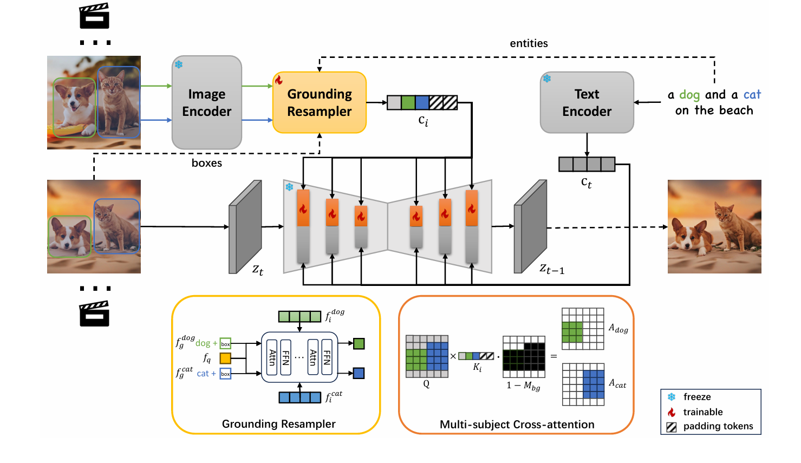
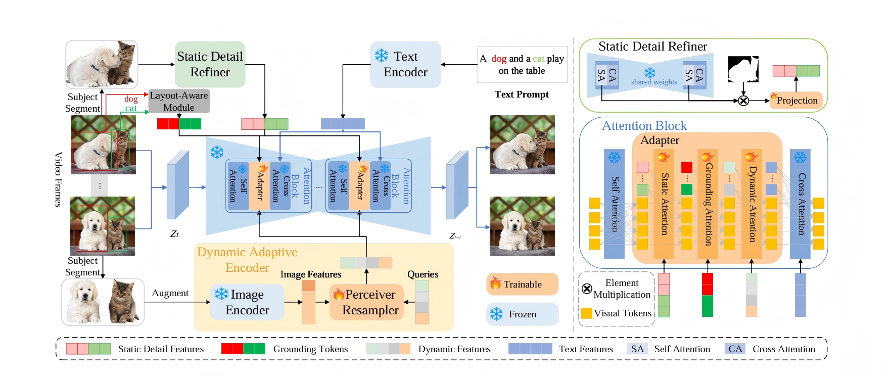
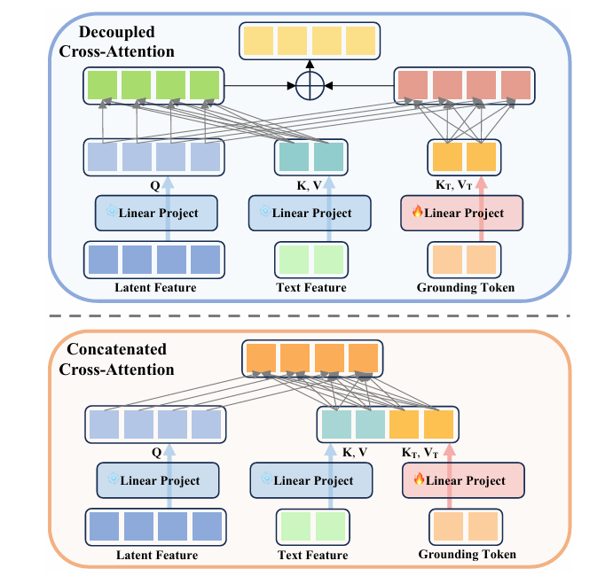
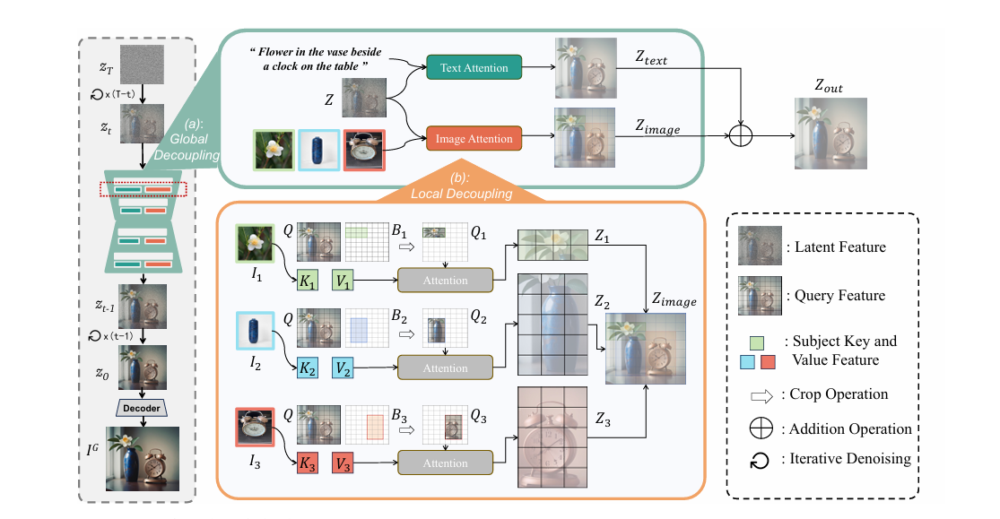

[toc]

# 多主体下的布局控制调研

# 1. MS-Diffusion

## 1.1 Abstract

MS-Diffusion 关注的是 **zero-shot multi-subject image personalization with layout guidance**。

作者认为，已有 personalized text-to-image 方法大多只能较好处理 single-subject。当输入多个参考主体时，模型容易出现：

- **Subject Neglect**：某个主体没有生成出来；
- **Subject Overcontrol**：某个主体的特征影响整张图；
- **Subject Conflict**：多个主体之间发生纹理、颜色或身份混合；
- **Layout Misalignment**：主体没有出现在指定 bbox 区域。

因此，作者写这篇论文的核心意图是：

> 在不对每个主体进行 test-time fine-tuning 的情况下，让扩散模型能够同时接收多个参考主体和对应 layout，并生成 identity-preserving、layout-aligned 的多主体图像。

## 1.2 Method 框架

MS-Diffusion 的整体框架由两个关键模块组成：

1. **Grounding Resampler**
   - 输入：reference image feature、text entity、bounding box。
   - 输出：包含主体身份、文本实体和空间位置的 grounding token。
2. **Multi-subject Cross Attention**
   - 在 image cross-attention 中引入 bbox mask。
   - 让 subject $i$ 的视觉特征主要影响 bbox $B_i$ 对应区域。

## 1.3 关键机制

MS-Diffusion 在多主体场景下加入空间 mask：

$$
\text{Attn}_i
=
M_i \odot
\text{Softmax}
\left(
\frac{QK_i^T}{\sqrt d}
\right)V_i
$$

其中：

- $K_i,V_i$ 是第 $i$ 个主体的 key/value；
- $M_i$ 由 bbox  $B_i$ 得到；
- $\odot$ 表示只让该主体条件主要作用于对应空间区域。

该机制的核心是：

> 用 bbox 限制 subject attention 的空间作用范围，从而缓解多主体之间的身份混合和主体缺失。

---

## 1.4 训练目标

MS-Diffusion 的训练目标本质上仍然是扩散模型的噪声预测目标，即在给定文本条件 $c_t$ 和图像主体条件 $c_i$ 的情况下，让模型预测加入到 latent 中的噪声：

$$
L_{IP}
=
\mathbb{E}_{z,c,\epsilon,t}
\left[
\left\|
\epsilon
-
\epsilon_\theta(z_t \mid c_t,c_i,t)
\right\|_2^2
\right]
$$

其中，预训练 SDXL 主体权重保持冻结，主要训练的是用于接收主体图像、实体文本和 bbox 信息的 Grounding Resampler 以及相关 image condition 注入模块。论文也讨论了 text/image attention loss 作为隐式 layout 约束，但最终方法主要依赖显式 layout guidance，而不是把 attention loss 作为核心训练目标。

# 2. LCP-Diffusion

## 2.1 Abstract

LCP-Diffusion 关注的是 **layout-controllable personalized diffusion for multiple subjects**。

作者认为，现有 personalized generation 方法存在两个主要问题：

- 主体身份保持不够细，尤其是姿态、视角、纹理和局部细节；
- 缺少精确 layout controllability，用户难以指定主体生成位置。

因此，作者提出 “Create Anything Anywhere” 的目标：

> 不仅要生成用户指定的主体，还要在用户指定的位置、组合和布局中生成这些主体。

## 2.2 Method 框架

LCP-Diffusion 的框架主要包括两个部分：

1. **Dynamic-Static Complementary Visual Refining, D-SCVR**
   - Dynamic Adaptive Encoder：提取姿态、视角、形变等动态变化特征；
   - Static Detail Refiner：提取稳定纹理、颜色、身份细节等静态特征。
2. **Dual Layout Control, DLC**
   - Layout-Aware Module：训练阶段将 bbox、实体文本和主体特征融合为 grounding token；
   - Box-Constrained Cross-Attention Regulation：推理阶段通过 attention loss 进一步约束主体位置。

## 2.3 关键机制

### Layout-Aware Grounding Token

LCP-Diffusion 将静态主体特征、文本实体和 bbox 位置编码融合成 grounding token：

$$
g =
\text{Concat}
\left(
\text{MLP}(c_s,F_{enc}(b)),
\text{MLP}(c_e,F_{enc}(b))
\right)
$$

其中：

- $c_s$：Static Detail Refiner 提取的主体静态细节特征；
- $c_e$：CLIP text encoder 得到的实体词 embedding；
- $b$：bounding box 坐标；
- $F_{enc}(b)$：bbox 的 Fourier positional encoding；
- $g$：融合主体身份和布局信息的 grounding token。

### Box-Constrained Cross-Attention Regulation

推理阶段，论文设计位置约束，使目标主体 token 的 attention 尽量集中在对应 bbox 中：

$$
L_{pos}
=
\sum_k
\left(
1-
\frac{
\sum_{(i,j)\in B_k}A^t_{(i,j),k}
}{
\sum_{(i,j)}A^t_{(i,j),k}
}
\right)
$$

其中：

- $A^t_{(i,j),k}$ 表示 timestep $t$ 时，第 $k$ 个主体 token 在位置 $(i,j)$ 的 attention score；
- $B_k$ 表示第 $k$ 个主体的目标 bbox。

最终通过位置损失和尺度损失更新 latent：

$$
z_t
\leftarrow
z_t
-
\alpha_t \eta
\nabla_{z_t}(L_{pos}+L_{scale})
$$

该机制的核心是：

> 训练阶段注入 layout-aware grounding token，推理阶段再用 attention loss 纠正主体位置。

---

## 2.4 训练目标

LCP-Diffusion 的训练阶段同样沿用 Stable Diffusion 的原始去噪 MSE 目标：在文本、参考主体特征和 grounding token 等条件下，让 U-Net 预测噪声：

$$
L
=
\mathbb{E}_{z,c,t,\epsilon}
\left[
\left\|
\epsilon
-
\epsilon_\theta(z_t,c,t)
\right\|_2^2
\right]
$$

训练时冻结预训练 U-Net，只优化 adapter 中的 static attention、grounding attention、dynamic attention、perceiver resampler 和 Layout-Aware 模块中的 MLP。其训练目标是让模型在去噪预测中同时学会利用主体静态细节、动态特征以及 bbox/layout grounding 信息。需要注意的是，论文中的 $L_{pos}$ 和 $L_{scale}$ 主要用于推理阶段的 box-constrained cross-attention regulation，用来更新 latent 并强化布局对齐，不是训练 adapter 时的主要监督目标。

# 3. MUSE

## 3.1 Abstract

MUSE 关注的是 **layout-controllable multi-subject synthesis, LMS**。

作者认为，已有方法将 layout control、text control 和 subject synthesis 同时注入模型时，会出现 **control collision**：

- text branch 根据文本和数据先验生成一种布局；
- layout branch 要求另一种布局；
- 两种 attention map 相加后互相干扰，导致 layout 不准或主体不稳定。

因此，作者写这篇论文的核心意图是：

> 将 layout 从额外控制信号转化为文本语义空间的一部分，使 layout control 与 text control 在同一次 attention 中协同，而不是互相竞争。

## 3.2 Method 框架

MUSE 的方法由两个核心设计组成：

1. **Explicit Layout Semantic Expansion**
   - 将 entity + bbox 编码为 layout semantic token；
   - 通过 CCA 将 layout 信息显式扩展到文本语义空间。

2. **Progressive Two-Stage Training**
   - Stage 1：训练 CCA，使模型先学会 text-aligned layout control；
   - Stage 2：在已有 layout-control 能力基础上加入 subject synthesis DCA。

## 3.3 关键机制

### DCA 的问题

传统 Decoupled Cross-Attention, DCA 通常写成：

$$
\text{DCA}
=
\text{Softmax}
\left(
\frac{QK^T}{\sqrt d}
\right)V
+
\lambda
\text{Softmax}
\left(
\frac{QK_L^T}{\sqrt d}
\right)V_L
$$

其中：

- 第一项是 text cross-attention；
- 第二项是 layout 或额外控制条件的 attention；
- 两个 attention map 分别计算后再相加。

MUSE 认为这种结构会造成 control collision，因为 text 和 layout 是两个独立控制源。

### CCA：Concatenated Cross-Attention

MUSE 改为先拼接 text token 和 layout token 的 key/value，再统一计算一次 attention：

$$
\text{CCA}
=
\text{Softmax}
\left(
\frac{Q[K;K_L]^T}{\sqrt d}
\right)
[V;V_L]
$$

其中：

- $K,V$ 来自文本条件；
- $K_L,V_L$ 来自 layout 条件；
- $[;]$ 表示 token 维度拼接。

该机制的核心是：

> layout 不再作为独立 attention 分支与 text 相加，而是作为文本语义扩展参与同一次 attention 计算。

### Progressive Two-Stage Training

MUSE 将 LMS 拆成两个子目标：

- 先学习 layout control；
- 再学习 subject synthesis。

这样做是为了避免同时优化 layout precision 和 identity preservation 时发生目标冲突。

---

## 2.4 训练目标

MUSE 的总体训练目标仍然保持与原始预训练扩散模型一致：在额外 layout / subject 控制条件下准确预测扩散过程中加入的噪声。论文补充材料明确说明，其 loss function 与原始预训练模型保持一致，即训练 diffusion network under multiple control conditions 去预测 added noise。

MUSE 的重点不在于引入新的额外损失，而在于把 LMS 任务拆成两个阶段来优化：

- Stage 1：训练基于 CCA 的 layout control 模型，使 layout token 被整合进文本语义空间，目标是先获得 text-aligned layout control；
- Stage 2：冻结已经学到布局控制能力的部分，再引入并训练 subject synthesis DCA，使模型在已有布局能力基础上增强 reference subject 的身份保持。

因此，MUSE 的训练目标可以理解为：用同一个扩散噪声预测损失，分阶段分别学习 layout precision 和 identity preservation，避免两类目标在单阶段联合训练时互相冲突。

# 4. AnyMS

## 4.1 Abstract

AnyMS 关注的是 **training-free layout-guided multi-subject customization**。

作者认为现有方法难以同时兼顾：

- text alignment；
- subject identity preservation；
- layout control。

问题根源在于不同 condition 之间的 attention conflict：

- 文本条件和图像条件竞争；
- 多个主体图像条件之间竞争；
- layout condition 和 subject condition 之间竞争。

因此，作者写这篇论文的核心意图是：

> 不额外训练新模块，而是在推理过程中通过 attention decoupling 清晰划分 text、subject image 和 layout 的作用边界。

## 4.2 Method 框架

AnyMS 的核心是 **Bottom-up Dual-level Attention Decoupling**，包括两层：

1. **Global Decoupling**
   - 分离 text cross-attention 和 image cross-attention；
   - 避免 subject token 与 text token 在同一 attention 中纠缠。

2. **Local Decoupling**
   - 使用 bbox 对 image attention 做 crop-and-merge；
   - 每个 spatial region 只 attend 对应 reference subject。

## 4.3 关键机制

### Global Decoupling

AnyMS 将 cross-attention 输出拆成文本分支和图像分支：

$$
Z_{out}
=
Z_{text}+Z_{image}
$$

其中：

$$
Z_{text}=CA_{text}(Z,P)
$$

$$
Z_{image}=CA_{image}(Z,\{(I_j,B_j)\}_{j=1}^{n})
$$

这一步解决的是 text condition 与 visual condition 的全局冲突。

### Local Decoupling

对于第 $j$ 个主体，其 bbox 为：

$$
B_j=[h_s:h_e]\times[w_s:w_e]
$$

从全局 query 中裁剪该区域：

$$
Q_j=Q[h_s:h_e,w_s:w_e]
$$

然后只让该区域 attend 第 $j$ 个主体：

$$
Z_j=
\text{Softmax}
\left(
\frac{Q_jK_j^T}{\sqrt d}
\right)V_j
$$

最后将局部结果 merge 回原位置：

$$
Z_{image}[h_s:h_e,w_s:w_e]=Z_j
$$

该机制的核心是：

> region $j$ only attends subject $j$，从而避免多个 reference subject 在同一区域竞争。

### Training-free Subject Feature Extraction

AnyMS 不训练新的 subject embedding，而是使用预训练 image adapter 提取主体特征：

$$
K_j=W'_k c_j,\quad V_j=W'_v c_j
$$

其中 $c_j$ 是第 $j$ 个参考主体的 image feature。

## 4.4 训练目标

AnyMS 是 training-free 方法，不训练新的主体 embedding、adapter 或扩散模型参数。因此严格来说，AnyMS 本身没有新的模型训练目标。

论文中给出的

$$
L_{rec}
=
\mathbb{E}_{z,\epsilon,t,c_t}
\left\|
\epsilon
-
\epsilon_\theta(z_t,t,c_t)
\right\|_2^2
$$

只是回顾 Stable Diffusion 预训练时使用的标准噪声重建损失。AnyMS 在推理阶段直接使用预训练扩散模型和预训练 image adapter，通过 global decoupling 与 local decoupling 重新组织 attention，使生成过程同时满足 text alignment、subject identity preservation 和 layout control。

---

# 5. 各论文方法汇总

| 论文          | 作者主要想解决的问题                                  | Method 框架                                                  | 关键机制                                                     | 是否 Training-free |
| ------------- | ----------------------------------------------------- | ------------------------------------------------------------ | ------------------------------------------------------------ | ------------------ |
| MS-Diffusion  | 多主体个性化中主体缺失、主体混合、布局不准            | Grounding Resampler + Multi-subject Cross Attention          | 用 bbox mask 限制每个 subject attention 的空间作用范围       | 否                 |
| LCP-Diffusion | 个性化主体细节不够保真，且缺少 layout controllability | D-SCVR + Dual Layout Control                                 | 动态/静态视觉特征互补；训练阶段 layout-aware token；推理阶段 attention loss 修正 bbox | 否，推理使用较灵活 |
| MUSE          | layout control 与 text control 发生 control collision | Explicit Layout Semantic Expansion + Progressive Two-Stage Training | 用 CCA 将 layout token 拼接进 text attention；先学 layout，再学 subject synthesis | 否                 |
| AnyMS         | text、subject image、layout 多条件 attention 冲突     | Bottom-up Dual-level Attention Decoupling                    | global text/image decoupling；local region-subject attention routing | 是                 |

